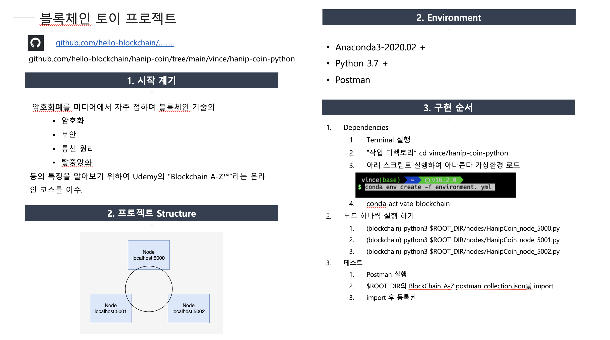

## 한잎코인 python version

재현과정
1. conda env 는 environment.yml 에서 실행

2. 다음 스크립트 실행 5000부터 5002까지 
   - python3 HanipCoin_node_5000.py
   - 그러면 노드가 실행이됨.

3. POSTMAN 에서 "blockchain_A-Z.postman_collection.json" 파일 import 하기

4. Request 들을 순차적으로 실행하면 됨

5. 모르는건 빈스한테 문의

 
